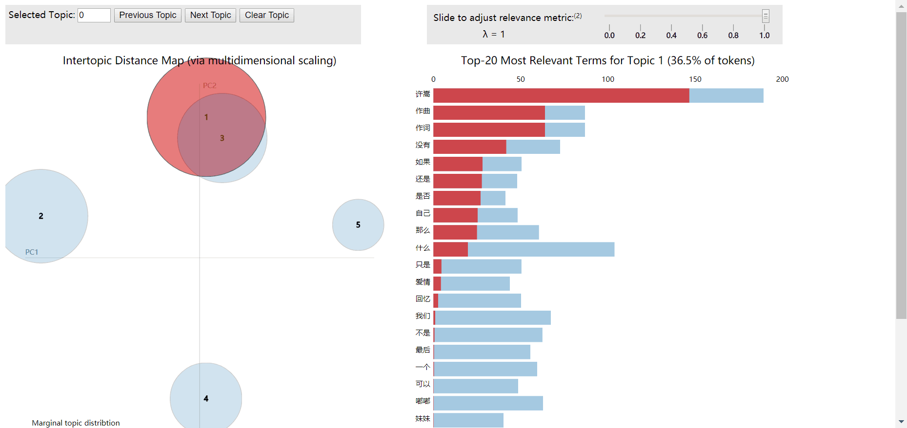

# CloudLRC-Spider
Use python to crawl the lyrics of all the singers of Netease Cloud Music, and analyze the data of word frequency, word cloud and subject model extraction on the lyrics text.

------

### get-artist_ids.py

Crawling website content: Use python's **request** and **bs4** to crawl http://music.163.com/#/discover/artist  , follow the singer category in the navigation bar on the left side of the page, crawl the singer related information in order, and follow-up will be used. Singer **id** and **name** are saved to the local csv file.

### get-lrc.py

The lyrics crawl: read the csv file singer information, use python's **request** and **bs4** to crawl the lyrics of each singer's Top50 song corresponding to the home page, and locally create a singer folder and save the Top50 **lyrics** txt text.

### word-analysis.py

Word Cloud Production: Read the lyrics of all the songs under each singer folder, use the **jieba** word segmentation tools and stop words to do preliminary data processing on all lyrics texts, and then do word **frequency statistics** to make the corresponding **word cloud** renderings.

### topic_analysis.py

Subject extraction: Read the lyrics of all songs under each singer folder, use **jieba** word segmentation tools and stop words to do data preprocessing on all lyric texts, and then perform **text vectorization** to display the first few keywords under each topic. Use **pyLDAvis** to do the **topic visualization**.

### P.s.

Because of the language charm of Chinese lyrics, a simple python sentiment analysis library does not allow accurate sentiment analysis, so it is not shown.